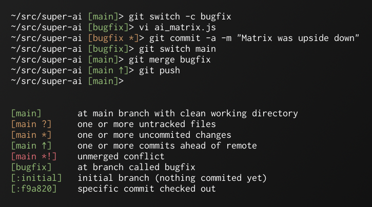

# git-prompt - Minimal Git prompt



* Shows only the essentials to keep noise down to a minimum.
* Colors for quick assesment of the situation.
* Calls only one external command (`git status --porcelain=v2 --branch`)
* Go and Python versions work with any shell that can call
  commands in a prompt.

There are four different implementations with identical output:

* [git-prompt.go](git-prompt.go) - Go version (must be compiled before use.)
* [git_prompt.py](git_prompt.py) - Python version
* [git-prompt.sh](git-prompt.sh) - Bash function
* [git_prompt.fish](git_prompt.fish) - Fish function


## Installing

Compiling the Go version::

```bash
go build git-prompt.go
```

Then copy `git-prompt` to somewhere in your path and add this to the
`PS1` variable in your `.bashrc` / `.zsh` or other config file:

```bash
$(git-prompt)
```

Here's what I use:

```bash
PS1='\u@\h:\w $(git-prompt)> '
```


Example Output
--------------

```
[main]        # At main branch with clean repository.
[main *]      # Uncommited changes.
[main ↑]      # One or more commits ahead of remote.
[main *?]     # Changes and untracked files.
[main *!]     # Unmerged conflict.
[:initial]    # New git repository with no commits yet.
```


Branch Name
-----------

```
main      Branch name.
:f9a02c   Detached head. (First 6 characters of commit hash.)
:initial  Initialized repository with nothing commited yet.
```

## Status Flags

```
*  Repository has uncommited changes.
?  There are untracked files.
!  There are conflicts.
↑  Local repository is ahead of remote by >= 1 commit.
↓  Local repository is behind remote by >= 1 commit.
↕  Local repository has diverged from remote.
    (It's both ahead and behind.)
```


## Colors

Green
: Working directory is clean but may be out of sync with remote.

Yellow
: There are changed or untracked files.

Red
: There are conflicts that need to be resolved.


## License


[MIT license](http://en.wikipedia.org/wiki/MIT_License>)


## Contact

Ole Martin Bjorndalen - ombdalen@gmail.com
